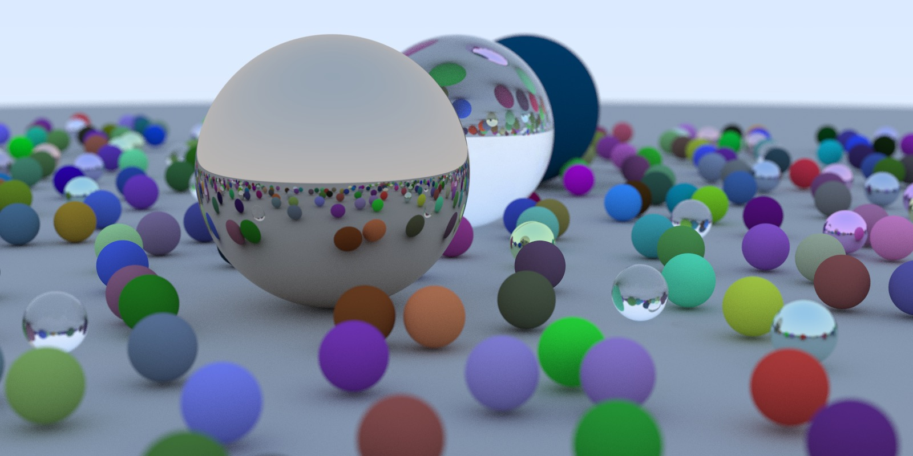
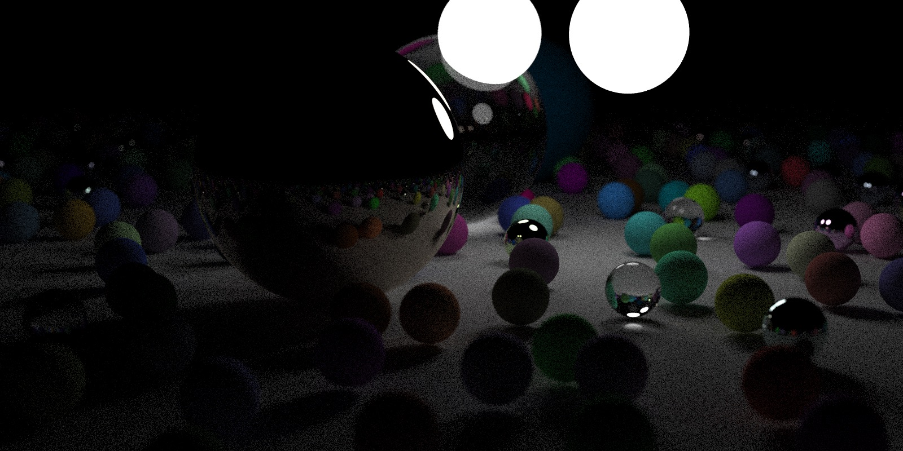

# Raytracer

A weekend raytracing project for macOS. Based on [Peter Shirley's](https://raytracing.github.io/books/RayTracingInOneWeekend.html) article.

## Engineering Notes

First, I've created a UI that renders a CGImage that is updated over time. I want this app
to have some sort of live preview of content. Avoiding tasks that aren't directly related to the core
of the project, but this one I think is important for me.

I want to write the raytracer mostly in C++, as an exercise to myself and to avoid the perf costs of Objective-C.
I want to also stick with Apple's tech: simd vector types, dispatch_apply, etc.

Doing a randomized progressive renderer ended up being super helpful to stop rendering early on and not waste time.
Keeping the number of work units small was critical. I only create a unit of work for a pixel, not for each permutation
of bounce or sample.

In the end I was able to use dispatch_apply and effectively do my goal of "progressive rendering previews". The overhead
cost was measured to be small during total compute. Doing the pattern of per-pixel dispatch_apply made the most sense,
rather than allocating the gigs needed to do per ray-test dispatch_apply. QoS normal was used, and balanced between UI events
and keeping work focused.

Final project screenshots. [See more here](Screenshots/). Background lighting vs. light-orbs with shadows:

## Tasks

- Now complete with weekend project! :)

## Complete

- Shadows
- Save image to /tmp on completion of render
- Move screenshots / video per build into a directory in the repo
- Defocus blur / depth of field effect
- Implement camera look-at (huh, not using matrix, but rather doing the math directly and simplified)
- Camera position
- Camera field-of-view (vertical degrees)
- Support front / back intersection differentiation
- Reflection & dielectrics
-- Backface testing not implemented
- Metallic material
-- Added roughness param
- Diffuse material
-- Lambertian distribution
- Fixed shadow acne
- Fixed gamma correction
- Reflect completion status in window..
- Randomize work items
- Avoid creating work items for anti-aliasing, just do that per pixel
- Rays bouncing
- Anti-aliasing added with naive random vector
- Deal with multiple objects and hit surface
- Hit test object closest
- Compute surface normals (and hit-position)
- Fix aspect ratio of camera with given texture size..
- Add a sphere shape type
- Add simple collision testing to sphere
- Add state machine for checking before / in-flight / complete drawing, avoid double-calling setup, etc.
- Fill with gradient as function of ray with camera setup
- Setup async per-pixel drawing logic
-- Complete via "WorkItem" pattern
- Setup the class structures in C++: raytracer, scene, camera, shape
- Create a simple UI that renders a CGImage from a bitmap
